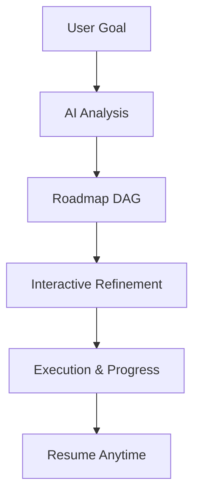
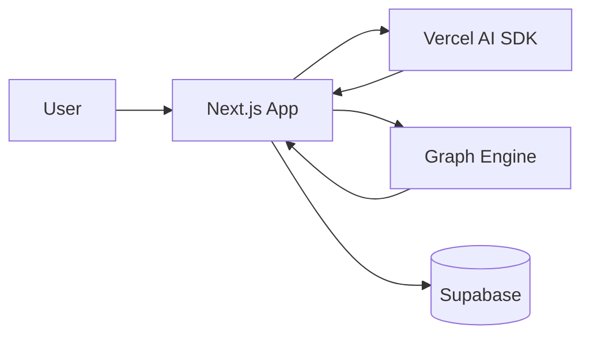

# AI-Powered Interactive Roadmap Platform

> **An AI-powered system that converts abstract learning or project intent into a structured, visual, and executable roadmap.**

---

## 🚀 Overview

The **AI-Powered Interactive Roadmap Platform** bridges the gap between *intent* and *execution*.

Traditional AI tools generate linear lists or static plans that fail to represent:
- Dependencies between concepts
- Parallel learning paths
- Long-term progress tracking

This project introduces a **graph-first, AI-native planning system** that combines:
- Conversational AI
- Interactive node-based visualization
- Persistent progress tracking

The result is a roadmap that users can **see, refine, and execute**, not just read.

---

## 🧠 Core Idea

Instead of returning text-based plans, the system generates a **Directed Acyclic Graph (DAG)** where:

- **Nodes** represent learning modules or milestones  
- **Edges** represent strict prerequisites  
- **Layout** encodes logical progression  

This graph acts as an **external cognitive scaffold**, reducing mental load and improving learning efficiency.

---

## ✨ Key Features

### 🔹 AI-Powered Roadmap Generation
- Converts high-level goals into structured DAGs
- Enforces prerequisite logic (no cycles)
- Supports parallel learning tracks

### 🔹 Interactive Visual Canvas
- Node-based roadmap using React Flow
- Automatic layout using ELK.js
- Smooth animated transitions

### 🔹 Chat ↔ Graph Feedback Loop
- Edit roadmaps via natural language
- AI performs graph mutations (add / replace / merge nodes)
- Instant visual confirmation

### 🔹 Drill-Down & Expansion
- Expand high-level topics into subgraphs
- Generate detailed execution plans incrementally

### 🔹 Progress Tracking
- Mark nodes as Pending / In Progress / Completed
- Automatically unlock dependent topics
- Highlight critical learning path

### 🔹 Resource Enrichment (RAG)
- Fetch curated learning resources per node
- Just-in-time retrieval to avoid overload

### 🔹 Persistence & Continuity
- Auto-save roadmap state
- Resume exactly where you left off
- Cross-device consistency

---

## 🧭 User Journey (High Level)



---

## 🏗️ Architecture Overview



---

## 🧰 Tech Stack

### Frontend
- **Next.js (App Router)**
- **React**
- **React Flow (xyflow)**
- **Tailwind CSS + Shadcn UI**
- **Zustand**

### Backend
- **Next.js Server Actions**
- **Edge Functions (Vercel)**

### AI
- **Vercel AI SDK**
- Structured JSON generation (Zod)
- Tool / function calling

### Data
- **Supabase (PostgreSQL + JSONB)**
- Row Level Security (RLS)

### Layout
- **ELK.js** (automatic DAG layout)

---

## 📂 Project Structure (Conceptual)

```
app/
 ├─ dashboard/
 ├─ roadmap/
 ├─ api/
components/
 ├─ RoadmapCanvas/
 ├─ ChatInterface/
 ├─ nodes/
store/
 ├─ roadmapStore.ts
actions/
 ├─ roadmap.ts
lib/
 ├─ schemas/
 ├─ ai/
```

---

## 🔐 Security & Reliability

- AI keys never exposed to client
- Row-level security enforced at DB layer
- Rate limiting on AI operations
- Graceful handling of partial AI failures

---

## 📈 Scalability & Future Work

- Real-time collaboration (CRDT / Yjs)
- Public roadmap marketplace
- GitHub project integration
- Semantic roadmap search
- Mentor / learner collaboration modes

---

## 🧪 Ideal Use Cases

- Learning complex technical skills
- Career roadmap planning
- Academic curriculum design
- Project execution planning
- Mentorship & guided learning

---

## 📜 License

This project is currently intended for **educational and experimental use**.  
License to be finalized.

---

## 🙌 Final Note

This project explores **AI-native interfaces**—moving beyond chatboxes into systems that think *with* the user, not *for* them.
