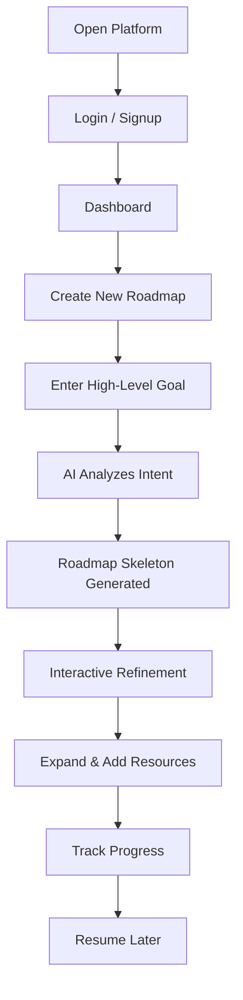
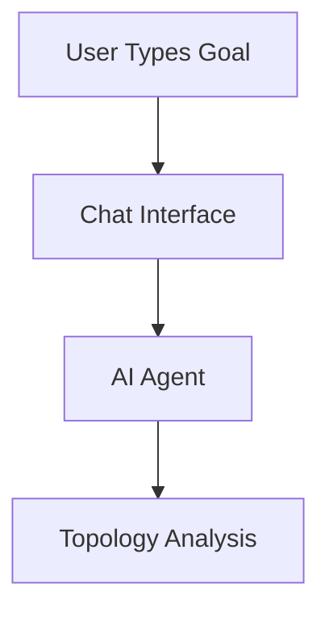
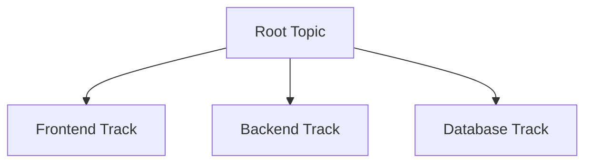
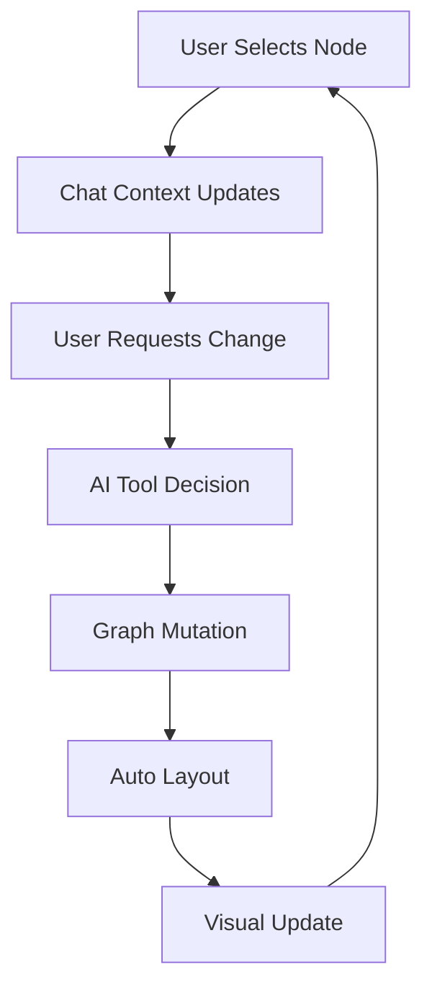
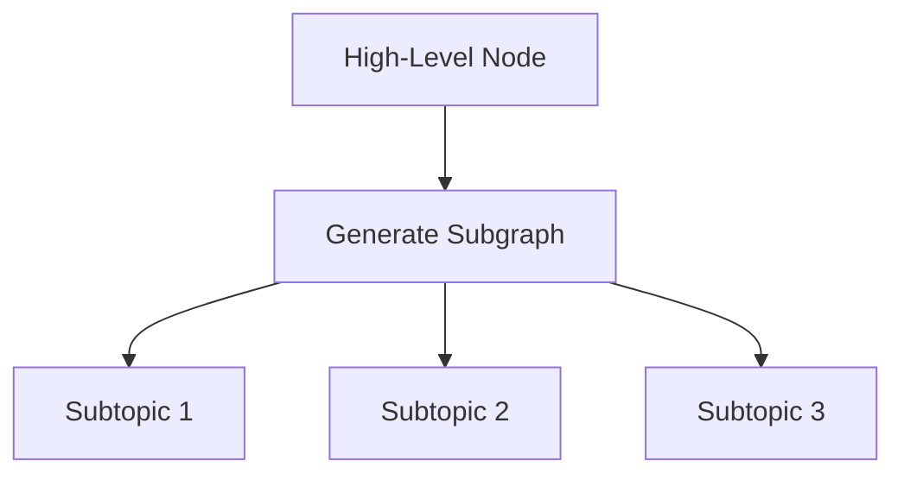
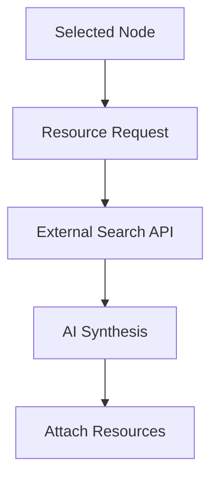
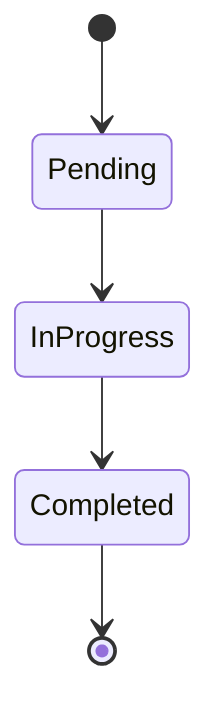
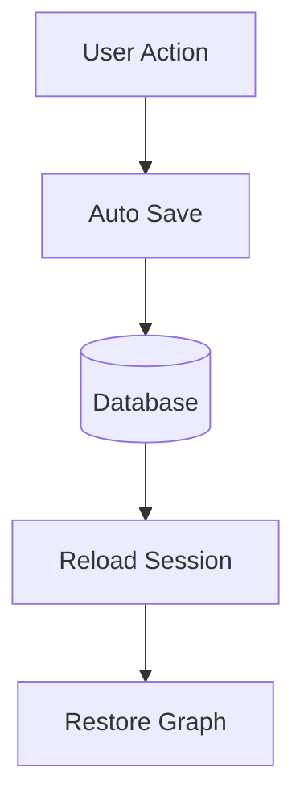
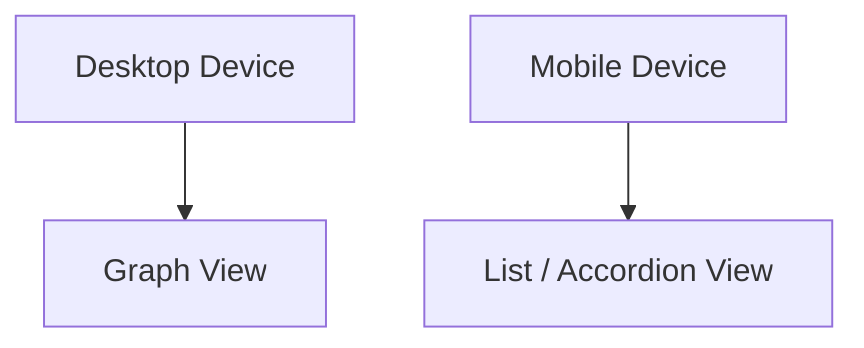

# User Journey Document  
## AI-Powered Interactive Roadmap Platform

This document presents the **end-to-end user journey** with **vertical box-style diagrams** for clear visual flow in Markdown viewers (GitHub, GitLab, Obsidian, Notion with Mermaid support).

---

## 1. User Persona

**User:** Self-directed learner / developer / professional  
**Goal:** Convert abstract intent into a structured, executable roadmap  
**Pain Point:** Linear plans do not capture dependencies or progress clearly

---

## 2. End-to-End User Journey (Vertical Flow)

---

## 3. Intent Capture & AI Understanding

---

## 4. Skeleton Roadmap Generation (Graph Creation)

---

## 5. Chat ↔ Graph Interaction Loop (Core Feature)

---

## 6. Drill-Down & Expansion Flow

---

## 7. Resource Enrichment (RAG Flow)

---

## 8. Learning Progress State Transitions

---

## 9. Persistence & Resume Flow

---

## 10. Desktop vs Mobile Experience

---

## 11. Journey Summary

✔ Intent-first design  
✔ Visual-first planning  
✔ Continuous AI + User feedback loop  
✔ Persistent, resumable learning  

The system acts as a **learning co-pilot**, not a static roadmap generator.

---

**End of User Journey Document**
